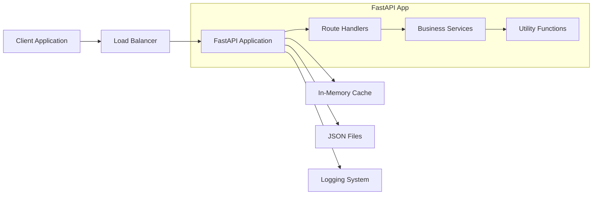
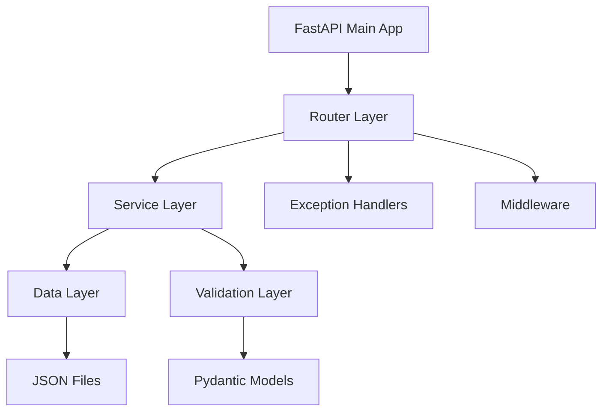

# Design: Truth and Dare API

## Overview
**Level**: STANDARD
**Generated**: 2025-09-03
**Status**: Draft

## Architecture

### System Architecture


### Component Architecture


## Components

### 1. FastAPI Application Layer (`app/main.py`)
- **Purpose**: Application entry point and configuration
- **Responsibilities**:
  - Initialize FastAPI app with metadata
  - Register routers and middleware
  - Configure CORS and security headers
  - Set up exception handlers
  - Configure logging

### 2. Router Layer (`app/routes/`)
- **Purpose**: HTTP endpoint definitions and request/response handling
- **Components**:
  - `truth.py`: Truth-related endpoints
  - `dare.py`: Dare-related endpoints  
  - `game.py`: Mixed game endpoints and health checks

### 3. Service Layer (`app/services/`)
- **Purpose**: Business logic implementation
- **Components**:
  - `truth_service.py`: Truth question logic and filtering
  - `dare_service.py`: Dare challenge logic and filtering
- **Key Methods**:
  - `get_random_truth(category: Optional[str])`
  - `get_random_dare(difficulty: Optional[str])`
  - `get_random_game_item()`

### 4. Data Layer (`app/utils/data_loader.py`)
- **Purpose**: JSON file loading and caching
- **Key Methods**:
  - `load_truths()`: Load and cache truth questions
  - `load_dares()`: Load and cache dare challenges
  - `refresh_cache()`: Reload data from files

### 5. Models Layer (`app/models/`)
- **Purpose**: Pydantic models for validation and serialization
- **Models**:
  - `TruthResponse`: Truth question response structure
  - `DareResponse`: Dare challenge response structure
  - `GameResponse`: Mixed game response structure
  - `ErrorResponse`: Standardized error response

## Data Models

### Truth Question Model
```python
from pydantic import BaseModel
from typing import Optional
from enum import Enum

class TruthCategory(str, Enum):
    GENERAL = "general"
    RELATIONSHIPS = "relationships"
    FUNNY = "funny"
    DEEP = "deep"
    EMBARRASSING = "embarrassing"

class Difficulty(str, Enum):
    EASY = "easy"
    MEDIUM = "medium"
    HARD = "hard"

class TruthResponse(BaseModel):
    type: str = "truth"
    content: str
    category: TruthCategory
    difficulty: Difficulty
    id: str
```

### Dare Challenge Model
```python
class DareMetadata(BaseModel):
    duration: Optional[int] = None  # minutes
    props_needed: list[str] = []

class DareResponse(BaseModel):
    type: str = "dare"
    content: str
    difficulty: Difficulty
    id: str
    metadata: DareMetadata
```

### Game Response Model
```python
from typing import Union

class GameResponse(BaseModel):
    type: str  # "truth" or "dare"
    content: str
    difficulty: Difficulty
    id: str
    category: Optional[TruthCategory] = None  # Only for truths
    metadata: Optional[DareMetadata] = None  # Only for dares
```

## API Endpoints

### Truth Endpoints

#### GET /api/v1/truth
- **Purpose**: Get random truth question
- **Parameters**: None
- **Response**: `TruthResponse`
- **Example Response**:
```json
{
  "type": "truth",
  "content": "What's the most embarrassing thing that happened to you in school?",
  "category": "embarrassing",
  "difficulty": "medium",
  "id": "truth_001"
}
```

#### GET /api/v1/truth/{category}
- **Purpose**: Get truth question from specific category
- **Parameters**: 
  - `category`: Path parameter (general|relationships|funny|deep|embarrassing)
- **Response**: `TruthResponse`
- **Validation**: Category must be valid enum value

### Dare Endpoints

#### GET /api/v1/dare
- **Purpose**: Get random dare challenge
- **Parameters**: None
- **Response**: `DareResponse`
- **Example Response**:
```json
{
  "type": "dare",
  "content": "Do your best impression of a celebrity for 2 minutes",
  "difficulty": "medium",
  "id": "dare_001",
  "metadata": {
    "duration": 2,
    "props_needed": []
  }
}
```

#### GET /api/v1/dare/{difficulty}
- **Purpose**: Get dare challenge of specific difficulty
- **Parameters**:
  - `difficulty`: Path parameter (easy|medium|hard)
- **Response**: `DareResponse`
- **Validation**: Difficulty must be valid enum value

### Game Endpoints

#### GET /api/v1/game/random
- **Purpose**: Get random truth or dare
- **Parameters**: None
- **Response**: `GameResponse`
- **Logic**: 50/50 chance between truth and dare

#### GET /api/v1/health
- **Purpose**: Health check endpoint
- **Response**: `{"status": "healthy", "timestamp": "2025-09-03T10:00:00Z"}`

## Error Handling

### Custom Exception Classes
```python
class TruthDareAPIException(Exception):
    def __init__(self, message: str, status_code: int = 500):
        self.message = message
        self.status_code = status_code

class CategoryNotFoundException(TruthDareAPIException):
    def __init__(self, category: str):
        super().__init__(f"Category '{category}' not found", 404)

class DifficultyNotFoundException(TruthDareAPIException):
    def __init__(self, difficulty: str):
        super().__init__(f"Difficulty '{difficulty}' not found", 404)
```

### Global Exception Handler
```python
@app.exception_handler(TruthDareAPIException)
async def custom_exception_handler(request: Request, exc: TruthDareAPIException):
    return JSONResponse(
        status_code=exc.status_code,
        content={
            "error": "API_ERROR",
            "message": exc.message,
            "timestamp": datetime.utcnow().isoformat()
        }
    )
```

### Standard Error Response Format
```json
{
  "error": "ERROR_CODE",
  "message": "Human readable error message",
  "timestamp": "2025-09-03T10:00:00Z"
}
```

## Caching Strategy

### In-Memory Caching
- **Implementation**: Python dictionaries for JSON data
- **Cache Keys**: `truths_cache`, `dares_cache`
- **Refresh Strategy**: On application startup and manual refresh endpoint
- **Memory Usage**: Estimated ~10MB for 2000 total items

### Cache Implementation
```python
class DataCache:
    def __init__(self):
        self._truths: List[dict] = []
        self._dares: List[dict] = []
        self._last_loaded: Optional[datetime] = None
    
    def load_data(self):
        # Load and cache JSON data
        pass
    
    def get_truths(self, category: Optional[str] = None) -> List[dict]:
        # Return filtered truths
        pass
```

## Security Considerations

### Input Validation
- All path parameters validated against enum values
- Request size limits to prevent abuse
- No user input stored or processed (read-only API)

### Security Headers
```python
app.add_middleware(
    CORSMiddleware,
    allow_origins=["*"],  # Configure based on deployment
    allow_credentials=True,
    allow_methods=["GET"],
    allow_headers=["*"],
)
```

### Rate Limiting
- Implement using `slowapi` (FastAPI wrapper for slow)
- Default: 100 requests per minute per IP
- Configurable via environment variables

## Testing Strategy

### Unit Tests
- Test all service layer functions
- Mock data loading for isolated testing
- Test edge cases (empty categories, invalid inputs)

### Integration Tests
- Test all API endpoints with TestClient
- Verify response formats and status codes
- Test error handling scenarios

### Test Structure
```python
# tests/test_truth_endpoints.py
def test_get_random_truth():
    response = client.get("/api/v1/truth")
    assert response.status_code == 200
    assert response.json()["type"] == "truth"

def test_get_truth_by_category():
    response = client.get("/api/v1/truth/funny")
    assert response.status_code == 200
    assert response.json()["category"] == "funny"
```

## Performance Optimization

### Response Time Targets
- Endpoint response time: < 200ms
- Data loading time: < 100ms on startup
- Memory usage: < 50MB total

### Optimization Strategies
- Pre-load all data on startup
- Use async/await for I/O operations
- Implement connection pooling for production
- Use uvloop for better async performance

## Deployment Considerations

### Docker Configuration
```dockerfile
FROM python:3.11-slim
WORKDIR /app
COPY requirements.txt .
RUN pip install -r requirements.txt
COPY . .
EXPOSE 8000
CMD ["uvicorn", "app.main:app", "--host", "0.0.0.0", "--port", "8000"]
```

### Environment Configuration
- Use Pydantic Settings for configuration
- Support for multiple environments (dev, staging, prod)
- Environment variables for all configurable values

### Health Monitoring
- `/health` endpoint for load balancer checks
- Structured logging for observability
- Metrics collection ready (response times, request counts)